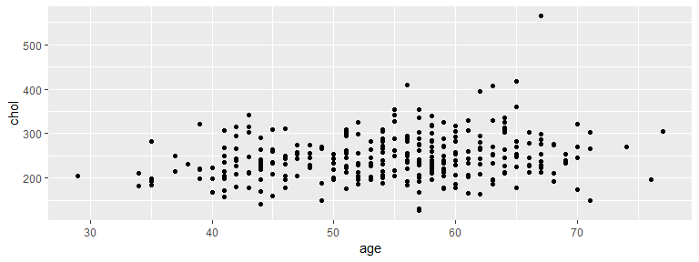

Visualization with ggplot2
================
Tapas Mishra
05/09/2019

## R Markdown

ggplot2 is an R package for producing statistical, or data, graphics,
but it is unlike most other graphics packages because it has a deep
underlying grammar.

ggplot comes from the ‘grammer of graphics’ i.e ‘gg’. The idea behind
this you create a grapgh piece by piece, something like layer on top of
another layer. This makes ggplot2 very powerful because you are not
limited to a set of pre-specified graphics, but you can create new
graphics that are precisely tailored for your problem.

All the plots are composed of

1.  Layers
2.  Scales
3.  Coordinate System (coord)
4.  Facet
5.  Themes


Let’s begin the Action ………

The first chunk in an R Notebook is usually titled “setup,” and by
convention includes the R packages you want to load. Remember, in order
to use an R package you have to run some `library()` code every session.
Execute these lines of code to load the packages.

    ## Registered S3 methods overwritten by 'ggplot2':
    ##   method         from 
    ##   [.quosures     rlang
    ##   c.quosures     rlang
    ##   print.quosures rlang

    ## -- Attaching packages ------------------------------------------------------------------------ tidyverse 1.2.1 --

    ## v ggplot2 3.1.1     v purrr   0.3.2
    ## v tibble  2.1.1     v dplyr   0.8.1
    ## v tidyr   0.8.3     v stringr 1.4.0
    ## v readr   1.3.1     v forcats 0.4.0

    ## -- Conflicts --------------------------------------------------------------------------- tidyverse_conflicts() --
    ## x dplyr::filter() masks stats::filter()
    ## x dplyr::lag()    masks stats::lag()

Lets begin with a data, I took a Heart disease sample data. The first 13
variables are various health parameters of participants , suggesting
they can used as explanatory variables , which can used to predict Heart
disease in a
patient.

``` r
heart.data <- read.csv("https://archive.ics.uci.edu/ml/machine-learning-databases/heart-disease/processed.cleveland.data",header=FALSE,sep=",",na.strings = '?')
names(heart.data) <- c( "age", "sex", "cp", "trestbps", "chol","fbs", "restecg",
                   "thalach","exang", "oldpeak","slope", "ca", "thal", "target")

#Removing few missing values
heart.data <- na.omit(heart.data)

# Lets check the dimensions of dataframe
dim(heart.data)
```

    ## [1] 297  14

Now, lets check the structure or datatypes of this sample

``` r
str(heart.data)
```

    ## 'data.frame':    297 obs. of  14 variables:
    ##  $ age     : num  63 67 67 37 41 56 62 57 63 53 ...
    ##  $ sex     : num  1 1 1 1 0 1 0 0 1 1 ...
    ##  $ cp      : num  1 4 4 3 2 2 4 4 4 4 ...
    ##  $ trestbps: num  145 160 120 130 130 120 140 120 130 140 ...
    ##  $ chol    : num  233 286 229 250 204 236 268 354 254 203 ...
    ##  $ fbs     : num  1 0 0 0 0 0 0 0 0 1 ...
    ##  $ restecg : num  2 2 2 0 2 0 2 0 2 2 ...
    ##  $ thalach : num  150 108 129 187 172 178 160 163 147 155 ...
    ##  $ exang   : num  0 1 1 0 0 0 0 1 0 1 ...
    ##  $ oldpeak : num  2.3 1.5 2.6 3.5 1.4 0.8 3.6 0.6 1.4 3.1 ...
    ##  $ slope   : num  3 2 2 3 1 1 3 1 2 3 ...
    ##  $ ca      : num  0 3 2 0 0 0 2 0 1 0 ...
    ##  $ thal    : num  6 3 7 3 3 3 3 3 7 7 ...
    ##  $ target  : int  0 2 1 0 0 0 3 0 2 1 ...
    ##  - attr(*, "na.action")= 'omit' Named int  88 167 193 267 288 303
    ##   ..- attr(*, "names")= chr  "88" "167" "193" "267" ...

Now , we are ready to explore this data. Let’s check some
    rows

``` r
head(heart.data)
```

    ##   age sex cp trestbps chol fbs restecg thalach exang oldpeak slope ca thal
    ## 1  63   1  1      145  233   1       2     150     0     2.3     3  0    6
    ## 2  67   1  4      160  286   0       2     108     1     1.5     2  3    3
    ## 3  67   1  4      120  229   0       2     129     1     2.6     2  2    7
    ## 4  37   1  3      130  250   0       0     187     0     3.5     3  0    3
    ## 5  41   0  2      130  204   0       2     172     0     1.4     1  0    3
    ## 6  56   1  2      120  236   0       0     178     0     0.8     1  0    3
    ##   target
    ## 1      0
    ## 2      2
    ## 3      1
    ## 4      0
    ## 5      0
    ## 6      0

Sometimes, people prefer to see their data in a more spreadsheet-like
format, and RStudio provides a way to do that. Go to the Console and
type `View(heart.data)` to see the data preview.

(An aside– `View` is a special function. Since it makes something happen
in the RStudio interface, it doesn’t work properly in R Notebooks. Most
R functions have names that start with lowercase letters, so the
uppercase “V” is there to remind you of its special status.)

## Consider

What relationship do you expect to see between Age and Cholestrol(chol)?

``` r
ggplot(data=heart.data )  +
  geom_point(mapping = aes(x = age , y = chol))
```

<!-- -->

Remember , ‘+’ indicates you keep on adding layers , This sign should
always be end of line.

## Remember this template - Made of 3 layers - Data, GEOM and Aesthetics

ggplot(data = <DATA>) + <GEOM_FUNCTION>(mapping = aes(<MAPPINGS>))
